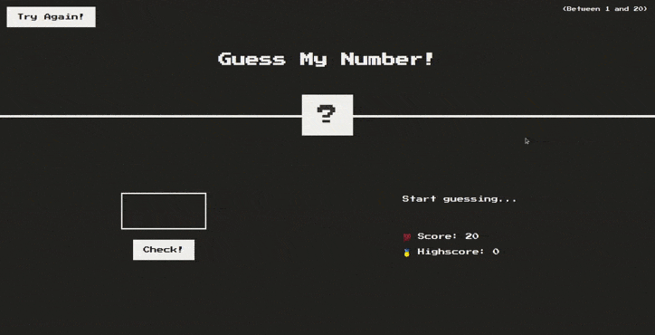

# guess-my-number-javascript

    

Source code of "Guess my number" game in Javascript.

If you want to take a look at the post on my portfolio where i talk about this project, you can find it <a href="https://pedro-hdez.github.io/juego-adivina-el-numero/"> here.</a>
